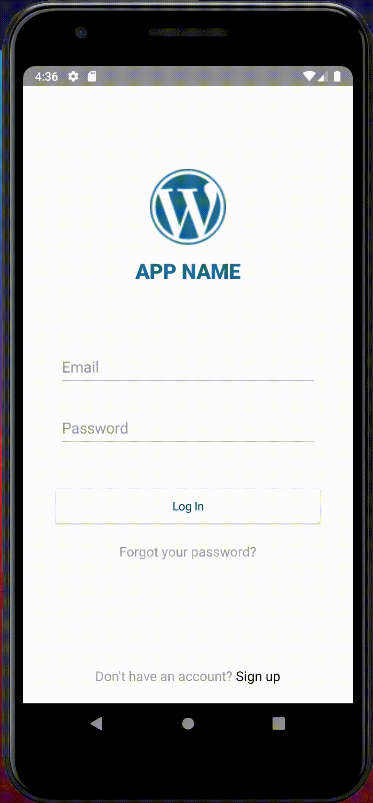

# nsWordPressLoginFormApp

[</img>](https://play.nativescript.org/?template=play-ng&id=Hqp5UQ&v=6155) Inspired by a Good-Looking Login Form App but the backdend uses [`WordPress oAuth2`](https://wordpress.org/plugins/oauth2-provider/) rather than `Kinvey`

[</img>](https://play.nativescript.org/?template=play-ng&id=Hqp5UQ&v=6155)

Example taken from [:bookmark:`nativescript.rocks`](https://plugins.nativescript.rocks/samples) and can be used as a template since it has already been converted to [NativeScript 7](https://nativescript.org/blog/nativescript-7-announcement)

## :bulb: Create a project by using this template

```
$ ns create nsWordPressLoginFormApp --template https://github.com/CraveFM/nsWordPressLoginFormApp.git
```

## :bookmark: Create a project from Scratch

```
$ ns create nsWordPressLoginFormApp --template @nativescript/template-blank-ng
```

- [ ] Assets

* Images are placed in the `src/assets` directory

```
$ mkdir src/assets
```

* Download the image

```
$ curl https://upload.wikimedia.org/wikipedia/commons/thumb/9/98/WordPress_blue_logo.svg/64px-WordPress_blue_logo.svg.png \
       -o src/assets/logo.png
```

## :a: Login Service Classes

:gear: Angular CLI schematics generation tools

```
$ npm install @schematics/angular @nativescript/schematics tslint --save-dev 
```

:pushpin: User Service

- [ ] Generate the `User` Class Model

```
$ ng generate class shared/User --skip-tests=true
```

- [ ] Edit `user.ts` and add the following instance variables (fields) to the `User` class

```typescript
    email: string;
    password: string;
    confirmPassword: string;
```

- [ ] Generate the `User` service

```
$ ng generate service shared/User --skip-tests=true
```

- [ ] Edit `user-service.ts` 

* change the constructor along with its appropriate import

```typescript
  constructor(private httpClient: HttpClient) {}
```

```typescript
import { HttpClient, HttpHeaders } from '@angular/common/http';
```

* Add the below methods along with its appropriate import

```typescript
  register(user: User) {
  }

  login(user: User) {
  }

  logout() {
  }

  resetPassword(email: string) {
  }
```

```typescript
import { User } from "./user";
```

- [ ] Edit `app.module.ts` 

* add the below `NativeScriptHttpClientModule` module to the `imports` property 

```typescript
@NgModule({
    bootstrap: [
        AppComponent
    ],
    imports: [
        NativeScriptHttpClientModule,
        NativeScriptModule,
        AppRoutingModule
    ],
    declarations: [
        AppComponent
    ],
    schemas: [
        NO_ERRORS_SCHEMA
    ]
})
export class AppModule { }
```

* add the `NativeScriptHttpClientModule` import statement

```typescript
import { NativeScriptHttpClientModule } from "@nativescript/angular";
```

## :b: Login Component

- [ ] Generate the component

```
$ ng generate component login  --skip-import --skipTests=true
```

* do some clean up

```
$ find src -name "*.tns.*" -exec rm {} \;  
```

```
$ find src -name "*.spec.ts" -exec rm {} \;   
```

- [ ] Instance Variables

```typescript
    isLoggingIn = true;
    user: User;
    processing = false;
    @ViewChild("password", {static: false}) password: ElementRef;
    @ViewChild("confirmPassword", {static: false}) confirmPassword: ElementRef;
```

- [ ] Constructor

```typescript
    constructor(private page: Page, private userService: UserService, private routerExtensions: RouterExtensions) {
        this.page.actionBarHidden = true;
        this.user = new User();
        this.user.email = "user@nativescript.org";
        this.user.password = "password";
    }
```

```typescript
    toggleForm() {
        this.isLoggingIn = !this.isLoggingIn;
    }

    submit() {
        if (!this.user.email || !this.user.password) {
            this.alert("Please provide both an email address and password.");
            return;
        }

        this.processing = true;
        if (this.isLoggingIn) {
            this.login();
        } else {
            this.register();
        }
    }

    login() {
        this.userService.login(this.user)
            .then(() => {
                this.processing = false;
                this.routerExtensions.navigate(["/home"], { clearHistory: true });
            })
            .catch(() => {
                this.processing = false;
                this.alert("Unfortunately we could not find your account.");
            });
    }

    register() {
        if (this.user.password != this.user.confirmPassword) {
            this.alert("Your passwords do not match.");
            return;
        }
        this.userService.register(this.user)
            .then(() => {
                this.processing = false;
                this.alert("Your account was successfully created.");
                this.isLoggingIn = true;
            })
            .catch(() => {
                this.processing = false;
                this.alert("Unfortunately we were unable to create your account.");
            });
    }

    forgotPassword() {
        prompt({
            title: "Forgot Password",
            message: "Enter the email address you used to register for APP NAME to reset your password.",
            inputType: "email",
            defaultText: "",
            okButtonText: "Ok",
            cancelButtonText: "Cancel"
        }).then((data) => {
            if (data.result) {
                this.userService.resetPassword(data.text.trim())
                    .then(() => {
                        this.alert("Your password was successfully reset. Please check your email for instructions on choosing a new password.");
                    }).catch(() => {
                        this.alert("Unfortunately, an error occurred resetting your password.");
                    });
            }
        });
    }

    focusPassword() {
        this.password.nativeElement.focus();
    }
    focusConfirmPassword() {
        if (!this.isLoggingIn) {
            this.confirmPassword.nativeElement.focus();
        }
    }

    alert(message: string) {
        return alert({
            title: "APP NAME",
            okButtonText: "OK",
            message: message
        });
    }
```

* add the `import` statements

```typescript
import { ViewChild, ElementRef } from '@angular/core';
import { alert, prompt, Page } from "@nativescript/core";
import { RouterExtensions } from "@nativescript/angular";
import { User } from "../shared/user";
import { UserService } from "../shared/user.service";
```

- [ ] Style Sheet

```css
.page {
  align-items: center;
  flex-direction: column;
}
.form {
  margin-left: 30;
  margin-right: 30;
  flex-grow: 2;
  vertical-align: middle;
}

.logo {
  margin-bottom: 12;
  height: 90;
  font-weight: bold;
}
.header {
  horizontal-align: center;
  font-size: 25;
  font-weight: 600;
  margin-bottom: 70;
  text-align: center;
  color: #21759b;
}

.input-field {
  margin-bottom: 25;
}
.input {
  font-size: 18;
  placeholder-color: #A8A8A8;
}
.input:disabled {
  background-color: white;
  opacity: 0.5;
}

.btn-primary {
  margin: 30 5 15 5;
}

.login-label {
  horizontal-align: center;
  color: #A8A8A8;
  font-size: 16;
}
.sign-up-label {
  margin-bottom: 20;
}
.bold {
  color: #000000; 
}
```

- [ ] XML Template

```xml
<FlexboxLayout class="page">
    <StackLayout class="form">
        <Image class="logo" src="~/assets/logo.png"></Image>
        <Label class="header" text="APP NAME"></Label>

        <PreviousNextView>
            <GridLayout rows="auto, auto, auto">
                <StackLayout row="0" class="input-field">
                    <TextField class="input" hint="Email" [isEnabled]="!processing"
                        keyboardType="email" autocorrect="false"
                        autocapitalizationType="none" [(ngModel)]="user.email"
                        returnKeyType="next" (returnPress)="focusPassword()"></TextField>
                    <StackLayout class="hr-light"></StackLayout>
                </StackLayout>

                <StackLayout row="1" class="input-field">
                    <TextField #password class="input" [isEnabled]="!processing"
                        hint="Password" secure="true" [(ngModel)]="user.password"
                        [returnKeyType]="isLoggingIn ? 'done' : 'next'"
                        (returnPress)="focusConfirmPassword()"></TextField>
                    <StackLayout class="hr-light"></StackLayout>
                </StackLayout>

                <StackLayout row="2" *ngIf="!isLoggingIn" class="input-field">
                    <TextField #confirmPassword class="input" [isEnabled]="!processing"
                        hint="Confirm password" secure="true" [(ngModel)]="user.confirmPassword"
                        returnKeyType="done"></TextField>
                    <StackLayout class="hr-light"></StackLayout>
                </StackLayout>

                <ActivityIndicator rowSpan="3" [busy]="processing"></ActivityIndicator>
            </GridLayout>
        </PreviousNextView>

        <Button [text]="isLoggingIn ? 'Log In' : 'Sign Up'" [isEnabled]="!processing"
            (tap)="submit()" class="btn btn-primary m-t-20"></Button>
        <Label *ngIf="isLoggingIn" text="Forgot your password?" class="login-label"
            (tap)="forgotPassword()"></Label>
    </StackLayout>

    <Label class="login-label sign-up-label" (tap)="toggleForm()">
        <FormattedString>
            <Span [text]="isLoggingIn ? 'Don’t have an account? ' : 'Back to Login'"></Span>
            <Span [text]="isLoggingIn ? 'Sign up' : ''" class="bold"></Span>
        </FormattedString>
    </Label>
</FlexboxLayout>
```

## :ab: Hooking up the Login component

- [ ] Edit `app-routing.module.ts` by replacing the JSON object in `const routes: Routes` 

```typescript
    { path: "", redirectTo: "/home", pathMatch: "full" },
```

by 

```typescript
    { path: "", redirectTo: "/login", pathMatch: "full" },
    { path: "login", component: LoginComponent },
```

along with the appropriate `import`

```typescript
import { LoginComponent } from "./login/login.component";
```

- [ ] Edit `app.module.ts` by adding the `LoginComponent` to the `declarations` property

```typescript
    declarations: [
        AppComponent,
        LoginComponent
    ],
```

along with the appropriate `import`

```typescript
import { LoginComponent } from "./login/login.component";
```

## :o: Home Component

- [ ] Home Component Template

* replace `<!-- Add your page content here -->` with

```xml
    <StackLayout>
        <Label class="body m-20" [text]="message" textWrap="true"></Label>
        <Button class="btn btn-primary" text="Log out" (tap)="logout()"></Button>
    </StackLayout>
```

- [ ] Home Component Class

* Instance Variable

```typescript
    message = "You have successfully authenticated. This is where you build your core application functionality.";
```

* Constructor

```typescript
    constructor(private userService: UserService, private routerExtensions: RouterExtensions) {
        // Use the component constructor to inject providers.
    }
```

* Other Methods

```typescript
    logout() {
        this.userService.logout();
        this.routerExtensions.navigate(["/login"], { clearHistory: true });
    }
```

* `import` statements

```
import { RouterExtensions } from "@nativescript/angular";
import { UserService } from "../shared/user.service";
```

## :o: Customization

:iphone: Android

Open up the manifest file `AndroidManifest.xml` (in `App_Resource/Android/src/main`) and add a new `<uses-permission>` tag in the `manifest` main tag:

```xml
    <uses-permission android:name="android.permission.ACCESS_NETWORK_STATE" />
```


## :x: Interceptor

```
$ ng generate class @auth/interceptors/jwt --skip-tests=true
```

```
$ ng generate service @auth/interceptors/jwt.interceptor --skip-tests=true
```

```
$ mv src/app/@auth/interceptors/jwt.interceptor.service.ts src/app/@auth/interceptors/jwt.interceptor.ts
```

The `jwt` Interceptor is implemented as a Service that will implement `HttpInterceptor` along with the `intercept` method

```
import { Injectable } from '@angular/core';
import { HttpEvent, HttpHandler, HttpInterceptor, HttpRequest } from '@angular/common/http';
import { Observable } from 'rxjs';
import  * as appSettings  from "@nativescript/core/application-settings";

@Injectable({
  providedIn: 'root'
})
export class JwtInterceptor implements HttpInterceptor {

  constructor() { }

  intercept(request: HttpRequest<any>, newRequest: HttpHandler): Observable<HttpEvent<any>> {
    const tokenInfo = appSettings.getString('TokenInfo');
    if (tokenInfo) {
      request = request.clone({
        setHeaders: {
          Authorization: `Bearer ${tokenInfo}`,
          'Content-Type': 'application/json'
        }
      });
    }

    return newRequest.handle(request);
  }

}
```  

```
$ ng generate service @auth/services/authentication --skip-tests=true
```


# References

https://stackoverflow.com/questions/56096867/httpinterceptor-in-nativescript-not-working-properly
